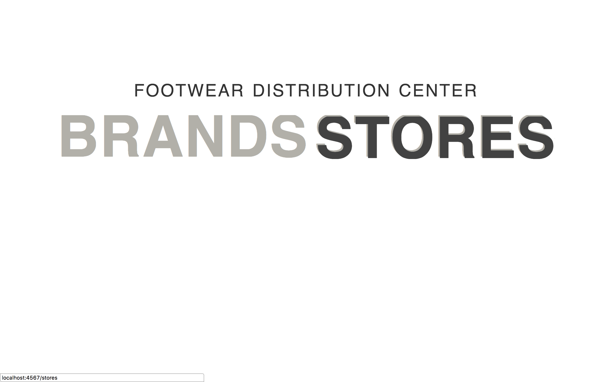
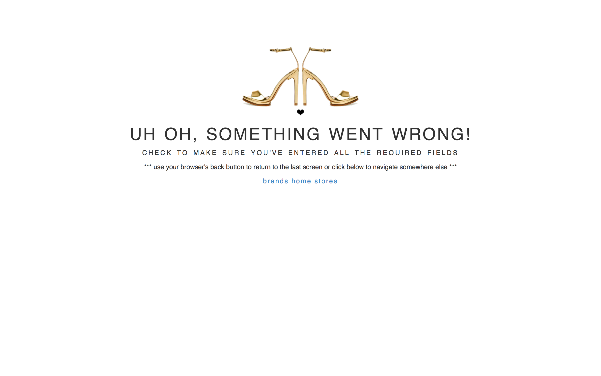

# Footwear Distribution

This website will allow footwear distributors to track which brands they offer and what stores carry them. Additionally, it will allow store owners to see which brands are available and add them to their own inventory.

## Screenshot - homepage



## Screenshot - error page



## Setup/Installation Requirements
- [ ] Clone this repository from the terminal
```
$ git clone https://github.com/callmedw/footwear_distribution.git
```
- [ ] ⌘Command T to open a new tab in the terminal and start postgres (leave it running in background)
```
$ postgres
```
- [ ] Make sure you have rake installed
```
$ gem install rake
```
- [ ] Navigate to the project directory
```
$ cd Desktop/footwear_distributor
```
- [ ] Load the database schema
```
$ rake db:schema:load
```
- [ ] Open the project in a text editor of your choice
```
$ atom .
```
- [ ] ⌘Command T to open another new tab in the terminal and start sinatra (leave it running in background)
```
$ ruby app.rb
```
- [ ] Navigate to localhost:4567 in a web browser of your choice

## Built With

* ActiveRecord
* Bootstrap
* CSS
* HTML
* Postgres
* Rake
* Ruby
* Sinatra

## Specifications

| behavior |  input   |  output  |
|----------|:--------:|:--------:|
| at homepage user may navigate to brands | user visits homepage, clicks brands | user taken to brand list and add a brand input |
| user may then add a brand to the distribution | name: "Cool Shoe Brand" cost: "500." click "Add Brand" | user now sees "Cool Shoe Brand $500.00" listed under brands |
| user can click on a brand to manage it's details | clicks "Cool Shoe Brand" | taken to Brand Management for "Cool Shoe Brand"|
| user may then update the brand name or cost | name: "Cooler Shoe Brand" cost: "1000." click "Update" | user now sees "Cooler Shoe Brand $1000.00" listed under brands |
| user may remove a brand from distribution | "Cooler Shoe Brand" clicks "Remove Cooler Shoe Brand" | "Cooler Shoe Brand" no longer appears in the list of brands |
| at homepage user may navigate to stores | user visits homepage, clicks stores | user taken to store list and add a store input |
| user may then add a store to the distribution | name: "Cool Shoe Store" click "Add Store" | user now sees "Cool Shoe Store" listed under stores |
| user can click on a store to manage it's details | clicks "Cool Shoe Store" | taken to Store Management for "Cool Shoe Store"|
| user may then update the store name or cost | name: "Cooler Shoe Store" click "Update" | user now sees "Cooler Shoe Store" listed under stores |
| user may remove a store from distribution | "Cooler Shoe Store" clicks "Remove Cooler Shoe Store" | "Cooler Shoe Store" no longer appears in the list of stores |


## Known Bugs
* title_case method not functional
* showing one place after decimal in cost
* kinda ugly

## Authors

Dana Weiss

## License

*open source GPL & MIT*

```
Copyright (c) 2017 **Dana Weiss**
```
